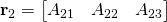
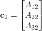
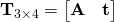

# Step 1: Getting to know Eigen
We will in this part of the lab go through the Eigen tutorial while trying out some code.

This part uses the ```lab_01_eigen``` subproject.
Open ```lab_01/lab_01_eigen/main.cpp``` in CLion.
Also make sure that we are using the build configuration for this subproject.
The build tab on the upper-right in CLion should look like this:


Use this project to solve the problems below.

## 1. Getting started
Read [Eigen's "Getting started" page](http://eigen.tuxfamily.org/dox/GettingStarted.html), and try the code examples.
You do not have to follow the "Compiling and running your first program" section.
CLion will take care of this for us, based on the project cmake-file.

## 2. Play with the tutorial
Continue with the [Eigen tutorial](http://eigen.tuxfamily.org/dox/group__TutorialMatrixClass.html).
While you read, try to solve the problems a) to e) below.

You should go through at least these pages:
- [The matrix class](http://eigen.tuxfamily.org/dox/group__TutorialMatrixClass.html)
- [Matrix and vector arithmetic](http://eigen.tuxfamily.org/dox/group__TutorialMatrixArithmetic.html)
- [The Array class and coefficient-wise operations](http://eigen.tuxfamily.org/dox/group__TutorialArrayClass.html)
- [Block operations](http://eigen.tuxfamily.org/dox/group__TutorialBlockOperations.html)
- [Advanced initialization](http://eigen.tuxfamily.org/dox/group__TutorialAdvancedInitialization.html)
- [Reductions, visitors and broadcasting](http://eigen.tuxfamily.org/dox/group__TutorialReductionsVisitorsBroadcasting.html)

Here are some other interesting resources:
- [Eigen documentation main page](http://eigen.tuxfamily.org/dox/)
- [Quick reference guide](http://eigen.tuxfamily.org/dox/group__QuickRefPage.html)
- [Matlab to Eigen translations](http://eigen.tuxfamily.org/dox/AsciiQuickReference.txt)

#### a) Create a few vectors and matrices


#### b) Coefficients
- Set *t*<sub>2</sub> = 2 and *A*<sub>12</sub> = 2, so that

    

- Perform the corresponding corrections to **T**, so that we still have

    

#### c) Block operations
- Extract the row vector
 
  
  
  and the column vector

  
  
  from **A**.

- Extract the submatrix

  

  from **T**.

- Set the corresponding blocks in **A** and **T** to all 0 (so that the second row and column in **A** are all 0, and the upper 3x4 matrix in **T** is all 0).

#### d) Matrix and vector arithmetic
- Add two vectors.
- Add two matrices.
- Multiply two matrices.
- Take the dot product between two vectors.
- Take the coefficient-wise multiplication between two matrices.

#### e) Reductions
- Take the sum of all elements in a matrix.
- Compute the minimum value in a matrix.
  - Also, find its position in the matrix.
- Create a vector that is the maximum of each column in a matrix.
- Find the L2-norm of a vector.
- Find the number of elements in a vector that is greater than a given value.

Now that you have gotten to know Eigen, lets use it to transform images in the [next part of the lab](2-image-transformations-with-eigen-and-opencv.md)!
