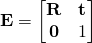
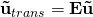
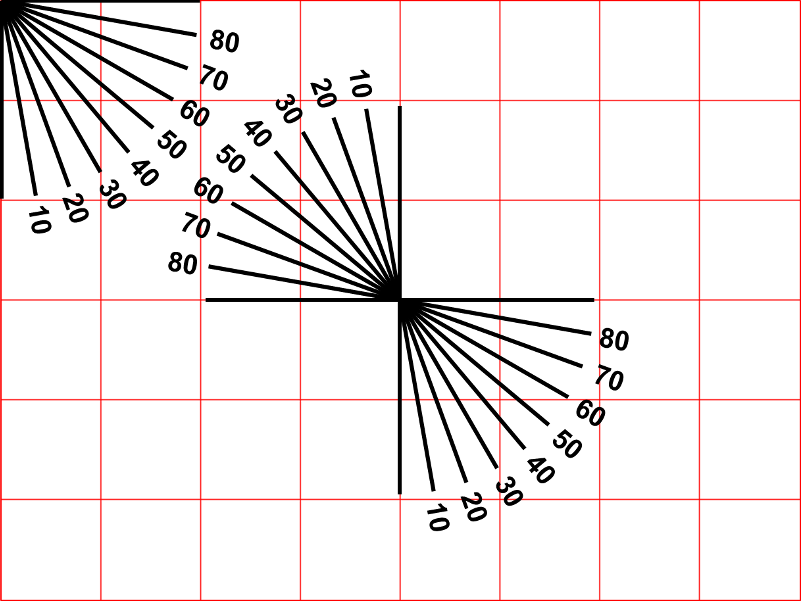

# Step 2: Image transformations
We will now use Eigen and OpenCV to transform image by applying transformation matrices on homogeneous form.

This part uses the ```lab_01_transformations``` subproject.
Open ```lab_01/lab_01_transformations/main.cpp``` in CLion.
Also make sure that we are using the build configuration for this subproject.

## 1. Eigen and homogeneous representations
- Use Eigen to define a 2D Euclidean transformation matrix

  

  where

    

  is the rotation matrix corresponding to a counterclockwise rotation with an angle *&theta;* about the origin, and

    

  is the translation vector.

- Define a pixel

    

- Obtain the transformed pixel **u**<sub>trans</sub> by computing the transformation using homogeneous coordinates

  

  for different values of **t**, *&theta;* and **u**.

**Tips**: 
- We have supplied a function for computing angles in *radians* from *degrees*.
- Use [homogeneous() and hnormalized()](http://eigen.tuxfamily.org/dox/group__Geometry__Module.html#gaf3229c2d3669e983075ab91f7f480cb1)!
  You might also want to take a look at the [Eigen geometry module](http://eigen.tuxfamily.org/dox/group__Geometry__chapter.html) .


## 2. Eigen and OpenCV
We can convert between Eigen matrices and OpenCV cv::Mats by using [cv::eigen2cv() and cv::cv2eigen()](https://docs.opencv.org/4.0.1/d0/daf/group__core__eigen.html).

- Convert the Eigen matrix **E** to a ```cv::Mat``` using ```cv::eigen2cv()```.

## 3. Transform images
We will now use this matrix to transform the image below:



Notice that you can use the grid and protractor to check your transformations.
There is 100 pixels between each grid line, and you can check the rotation by recognizing which protractor line is parallel with the new y-axis.

- Read the image using [cv::imread()](https://docs.opencv.org/3.3.1/d4/da8/group__imgcodecs.html#ga288b8b3da0892bd651fce07b3bbd3a56):

  ```c++
  // Read the image.
  cv::Mat img_orig = cv::imread("../../lab_01_transformations/img_grid.png");
  if (img_orig.empty())
  {
    std::cerr << "Could not find image file" << std::endl;
    return EXIT_FAILURE; 
  }
  ```

- Display the original image using [cv::imshow()](https://docs.opencv.org/3.3.1/d7/dfc/group__highgui.html#ga453d42fe4cb60e5723281a89973ee563):

  ```c++
  // Display the original image.
  std::string orig_win_title{"Lab 1.2: Original image"};
  cv::namedWindow(orig_win_title, cv::WINDOW_NORMAL);
  cv::imshow(orig_win_title, img_orig);
  ```

- Perform the transformation using [cv::warpPerspective()](https://docs.opencv.org/3.3.1/da/d54/group__imgproc__transform.html#gaf73673a7e8e18ec6963e3774e6a94b87):

  ```c++
  // Perform transformation on the image.
  cv::Mat img_trans_E;
  cv::warpPerspective(img_orig, img_trans_E, E_cv, img_orig.size(), cv::INTER_CUBIC);
  ```
  
  The last two arguments are the output size and interpolation method.
  
- Display the result.
- Try different transformations.
- Try the *inverse* transformation (how can you easily compute that?).

## 4. Composing transformations
Have you noticed that the image is rotated around the upper left corner?
Why is this so?

We can rotate around the image center by first translating the origin to the center, rotating and then translate back by performing the opposite translation. 
We can compose these transformations to a single transformation by multiplying all corresponding transformation matrices together:


- Rotate the image about its center by computing the composed transformation above.
- Finally, try adding a scaling transformation (zoom) after the rotation. What kind of composed transformation do we obtain then?

## Resources
- [Eigen documentation main page](http://eigen.tuxfamily.org/dox/)
- [Quick reference guide](http://eigen.tuxfamily.org/dox/group__QuickRefPage.html)
- [Matlab to Eigen translations](http://eigen.tuxfamily.org/dox/AsciiQuickReference.txt)

